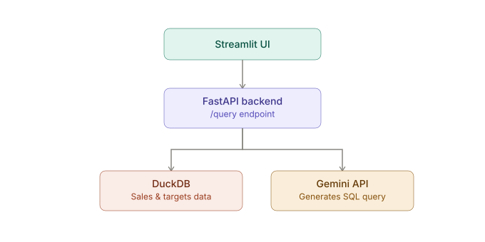
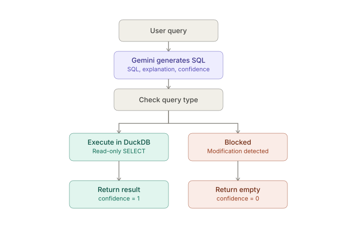
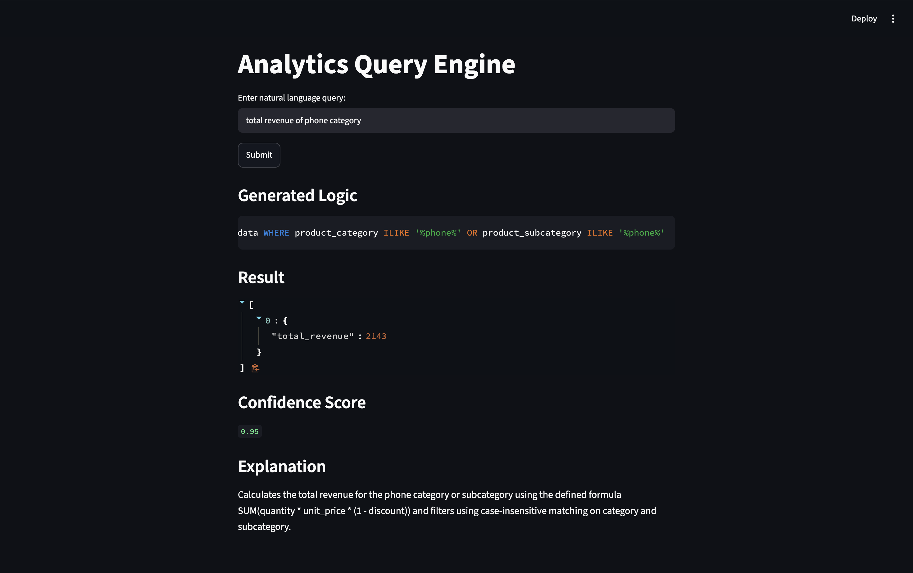
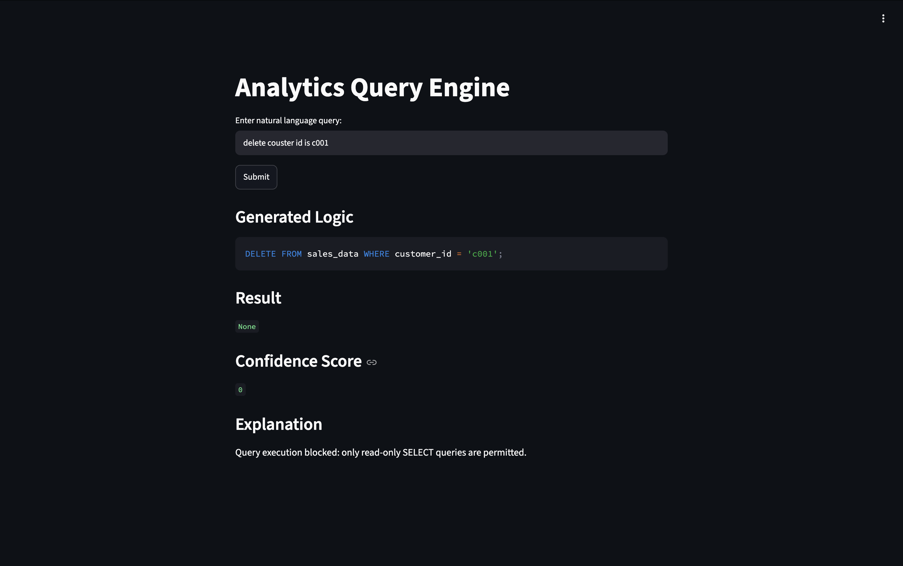
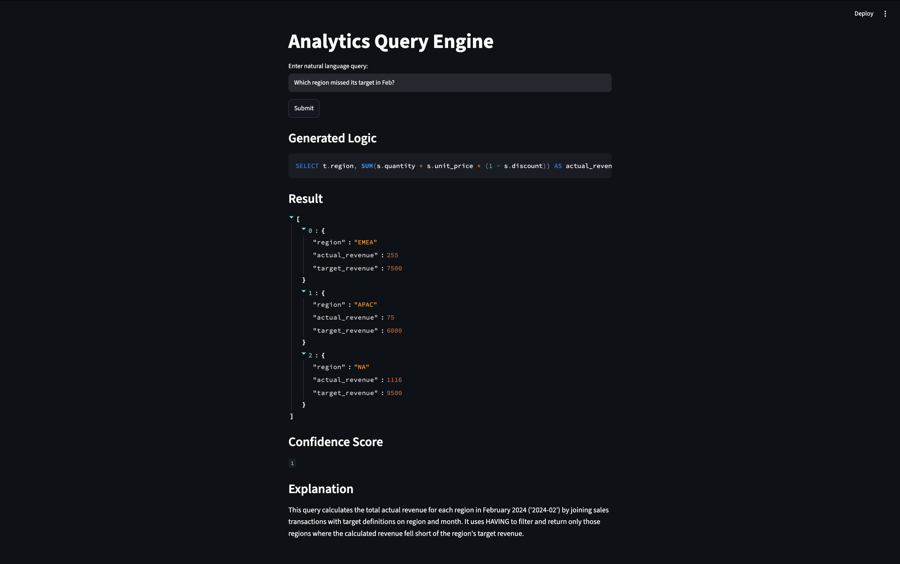

# Intelligent Analytics Query Engine

A natural language analytics tool that converts business questions into SQL, runs them against in-memory DuckDB tables, and returns clean results with human explanations. Built with strict read-only safety and deterministic confidence scoring.

---

## 1. Approach

Here is how the engine works:

- **In-memory DuckDB**: Loads CSV datasets on startup. Runs fast analytical queries (joins, window functions, aggregations) in milliseconds with zero database setup.
- **Schema & metric context**: Dynamically injects table schemas, business formulas (like revenue after discount), and few-shot examples into the Gemini prompt.
- **Read-only safety guard**: Checks the SQL verb before running. Only `SELECT` queries can execute. Any modification query (`DELETE`, `UPDATE`, `DROP`, etc.) is immediately blocked.
- **Single direct LLM call**: Uses one prompt to Gemini and gets back structured JSON (`sql`, `explanation`, `confidence_score`). No slow multi-agent chains.
- **1-shot self-healing**: If DuckDB encounters a syntax error, the engine sends the error back to Gemini once to fix the query automatically.
- **Binary confidence score**: Simple 0 or 1. `1` means the query was safe and executed cleanly. `0` means it was either blocked by the safety guard or failed to run.

---

## 2. Architecture & Working Flow

### Tech Architecture


- **Streamlit**: Simple web interface for asking questions and viewing results.
- **FastAPI backend**: Handles API requests, schema compilation, and query execution.
- **DuckDB**: Fast in-memory engine storing sales and target data.
- **Google Gemini**: Translates plain-English questions into valid SQL.

### Core Working Flow


1. The user asks a question in plain English.
2. Gemini translates it into SQL with an explanation.
3. The safety guard checks if the query is strictly a `SELECT`.
4. If safe, DuckDB runs the SQL, returns the data, and marks `confidence = 1`.
5. If it's a modification query (like `DELETE`), execution is blocked, returning an empty result and `confidence = 0`.

---

## 3. UI in Action

### Natural Language Analytics
Ask questions in plain English to calculate metrics like revenue across categories:


### Read-Only Safety Guard in Action
Any attempt to delete or alter data is caught and blocked before touching the database:


### Complex Multi-Table Analysis
Compare actual sales performance against monthly targets across regions:


---

## 4. Architectural Tradeoffs

| Decision | Chosen Approach | Alternative Considered | Why & Tradeoff |
|---|---|---|---|
| **Database** | In-Memory DuckDB | Postgres / SQLite | Fast in-memory queries with zero setup. Resets on restart, which fits read-only analytical datasets. |
| **Safety Guard** | Fast keyword check (`is_select_only`) | Heavy AST parser (`sqlglot`) | Checks query verbs directly with zero external dependencies. Simple, fast, and blocks any modification query. |
| **LLM Design** | Single Gemini call with structured JSON | Multi-agent frameworks (LangChain) | Keeps latency low, stays within API rate limits, and uses clean code instead of heavy abstractions. |
| **Confidence** | Binary score (`0` or `1`) | Fractional percentage (`0.85`) | Clear and deterministic. `1` means it ran successfully, `0` means it failed or was blocked. |
| **App Architecture** | Decoupled FastAPI + Streamlit | Single monolithic Streamlit script | UI re-renders never reload the database or re-run backend logic. Both services run cleanly together. |

---

## 5. Docker

### Run with Docker Compose Locally
```bash
# Build and start both containers
docker compose up -d --build

# View logs
docker compose logs -f
```

---

## 6. Sample Inputs and Outputs

For a comprehensive catalog of sample queries and their exact API response structures across aggregations, window rankings, target comparisons, and blocked operations, see **[SAMPLE_IO.md](SAMPLE_IO.md)**.
