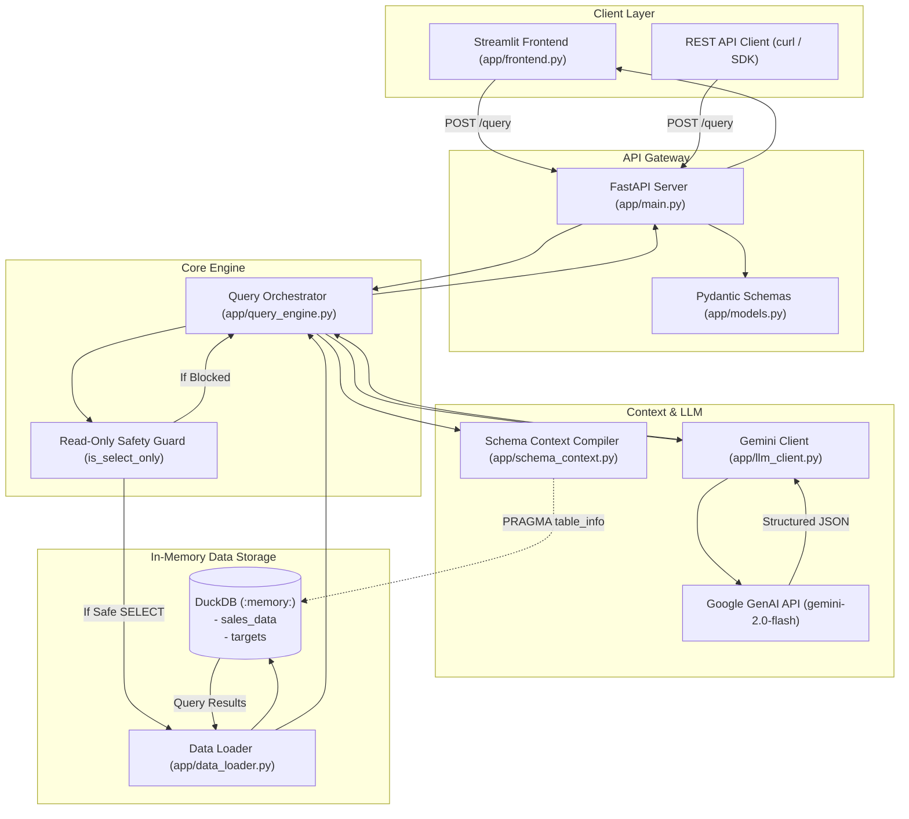
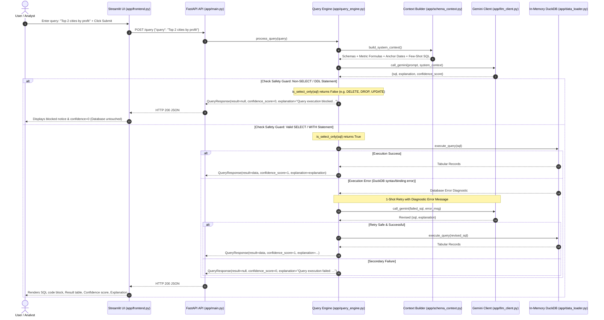

# Intelligent Analytics Query Engine

A clean, direct, and production-ready natural language analytics query engine. It translates business questions into executable SQL, runs them against in-memory DuckDB tables, enforces strict read-only safety, and returns verified analytical results with plain-English explanations and a deterministic boolean confidence score.

---

## 1. Approach

The engine is engineered for simplicity, speed, domain precision, and dataset security:

- **In-Memory Analytical Execution via DuckDB**: Ingests `dataset/sales_data.csv` and `dataset/targets.csv` directly into an in-memory DuckDB instance at application startup using native `read_csv_auto`. Provides columnar analytical execution (window ranking, CTEs, multi-table joins) in under 5ms with zero external database dependencies.
- **Direct Domain Grounding & Semantic Context**: Rather than passing raw data to the LLM, the system dynamically introspects table schemas via `PRAGMA table_info` and injects exact business metric definitions from `dataset/data_dictionary.json` (such as `revenue = quantity * unit_price * (1 - discount)`), temporal benchmark anchors (`2024-03-31`), and canonical few-shot SQL examples directly into the system prompt.
- **Read-Only Safety Guard**: Before any SQL statement is executed against DuckDB, a zero-dependency safety inspector verifies that the query is a pure read-only operation (`SELECT` or safe `WITH ... SELECT`). Any data modification or DDL command (`DELETE`, `UPDATE`, `INSERT`, `DROP`, `ALTER`, `TRUNCATE`, `CREATE`) is immediately intercepted and blocked from execution.
- **Single Direct Gemini LLM Call**: Translates natural language into structured JSON (`sql`, `explanation`, `confidence_score`) through a single call to Google GenAI (`gemini-2.0-flash` / `gemini-3.6-flash`), eliminating overhead and latency from multi-agent chains.
- **Resilient 1-Shot Self-Correction**: If DuckDB encounters an execution error, the engine automatically retries once by passing the failed SQL and exact database error diagnostic back to Gemini for targeted correction.
- **Deterministic Boolean Confidence (0 or 1)**: Replaces subjective fractional percentages with a binary contract: `1` for all successfully executed safe read-only queries (including valid 0-row results), and `0` in exactly two failure conditions: (1) query blocked by the safety guard, or (2) unresolvable SQL execution failure.

---

## 2. Architecture & File Roles

### System Architecture Diagram



---

### Project File Structure & Responsibilities

| File / Directory | Purpose & Responsibility |
|---|---|
| [`app/main.py`](file:///Users/tejaspatare/Documents/Dev%20Task/Inovative%20Ai%20lab/GenAI/app/main.py) | **API Entrypoint**: Initializes the FastAPI application, manages lifespan startup hooks (`init_db()`), loads environment variables from `.env`, and exposes `GET /health` and `POST /query`. |
| [`app/frontend.py`](file:///Users/tejaspatare/Documents/Dev%20Task/Inovative%20Ai%20lab/GenAI/app/frontend.py) | **Streamlit User Interface**: Minimal single-file web client. Takes natural language queries, submits HTTP requests to FastAPI, and renders SQL logic, tabular results, confidence scores, and error banners. |
| [`app/query_engine.py`](file:///Users/tejaspatare/Documents/Dev%20Task/Inovative%20Ai%20lab/GenAI/app/query_engine.py) | **Core Orchestrator**: Coordinates prompt construction, LLM generation, the read-only safety guard (`is_select_only`), DuckDB execution, 1-shot retry on database errors, and boolean confidence assignment. |
| [`app/data_loader.py`](file:///Users/tejaspatare/Documents/Dev%20Task/Inovative%20Ai%20lab/GenAI/app/data_loader.py) | **Database Manager**: Ingests CSV files into DuckDB in-memory tables (`sales_data`, `targets`) using `read_csv_auto`, maintains the connection singleton, and executes SQL queries returning list-of-dict rows. |
| [`app/schema_context.py`](file:///Users/tejaspatare/Documents/Dev%20Task/Inovative%20Ai%20lab/GenAI/app/schema_context.py) | **Domain Context Compiler**: Dynamically inspects DuckDB schemas, loads business metrics from `data_dictionary.json` and canonical few-shot SQL examples from `nl_queries.json`, and assembles the system prompt. |
| [`app/llm_client.py`](file:///Users/tejaspatare/Documents/Dev%20Task/Inovative%20Ai%20lab/GenAI/app/llm_client.py) | **Language Model Interface**: Direct, lightweight integration with Google GenAI SDK. Dispatches prompts and enforces structured JSON responses containing `sql`, `explanation`, and `confidence_score`. |
| [`app/models.py`](file:///Users/tejaspatare/Documents/Dev%20Task/Inovative%20Ai%20lab/GenAI/app/models.py) | **Data Contracts**: Pydantic models for `QueryRequest` and `QueryResponse`, strictly validating inputs and enforcing the binary `int` `confidence_score` contract (0 or 1). |
| [`dataset/`](file:///Users/tejaspatare/Documents/Dev%20Task/Inovative%20Ai%20lab/GenAI/dataset) | **Operational Data Assets**: Contains `sales_data.csv` (order transactions), `targets.csv` (monthly regional targets), `data_dictionary.json` (semantic formulas and synonyms), and `nl_queries.json`. |
| [`tests/test_engine.py`](file:///Users/tejaspatare/Documents/Dev%20Task/Inovative%20Ai%20lab/GenAI/tests/test_engine.py) | **Engine Test Suite**: 8 unit & integration tests covering table loading, multi-table joins, window ranking, 1-shot error recovery, 0-row handling, blocked modification queries, and HTTP endpoints. |
| [`tests/test_frontend.py`](file:///Users/tejaspatare/Documents/Dev%20Task/Inovative%20Ai%20lab/GenAI/tests/test_frontend.py) | **Frontend Test Suite**: 4 simulated UI tests using Streamlit `AppTest` verifying initial render, empty input validation, successful response rendering, and connection error handling. |
| [`tests/test_queries.py`](file:///Users/tejaspatare/Documents/Dev%20Task/Inovative%20Ai%20lab/GenAI/tests/test_queries.py) | **Quota-Efficient Integration Test**: Validates the end-to-end API pipeline against a single canonical query to prevent rate limit exhaustion. |
| [`run_validation.py`](file:///Users/tejaspatare/Documents/Dev%20Task/Inovative%20Ai%20lab/GenAI/run_validation.py) | **Benchmark Runner**: Quick smoke-test script executing against live or in-process engine. |
| [`SAMPLE_IO.md`](file:///Users/tejaspatare/Documents/Dev%20Task/Inovative%20Ai%20lab/GenAI/SAMPLE_IO.md) | **Sample Input & Output Reference**: Comprehensive catalogue of real API requests and exact JSON responses across all query categories. |
| [`AWS_DEPLOYMENT.md`](file:///Users/tejaspatare/Documents/Dev%20Task/Inovative%20Ai%20lab/GenAI/AWS_DEPLOYMENT.md) | **Cloud Deployment Guide**: Step-by-step instructions for containerizing and deploying to AWS App Runner, AWS ECS Fargate, or AWS EC2. |
| [`Dockerfile`](file:///Users/tejaspatare/Documents/Dev%20Task/Inovative%20Ai%20lab/GenAI/Dockerfile) & [`docker-compose.yml`](file:///Users/tejaspatare/Documents/Dev%20Task/Inovative%20Ai%20lab/GenAI/docker-compose.yml) | **Containerization**: Multi-stage production container setup supporting native multi-service orchestration without shell wrappers. |

---

## 3. End-to-End Request & Data Flow



---

## 4. Architectural Tradeoffs

| Decision | Chosen Approach | Alternative Considered | Tradeoff & Rationale |
|---|---|---|---|
| **Database Engine** | **In-Memory DuckDB (`:memory:`)** | External PostgreSQL or SQLite | **Chosen**: Instant queries (< 5ms), zero network overhead, zero external database setup, native `read_csv_auto`, and modern analytical SQL support (window ranking, CTEs).<br>**Tradeoff**: Non-persistent across server reboots (ideal for analytical evaluation against static CSVs; persistent transactional databases would be needed for write-heavy OLTP). |
| **Safety Guard** | **Lightweight Keyword Inspection (`is_select_only`)** | Full SQL AST Parser (`sqlglot` / `sqlparse`) | **Chosen**: Fast ($< 0.1$ms), zero extra dependencies, plain functions, strips comments and inspects token verbs to strictly block `DELETE`, `UPDATE`, `INSERT`, `DROP`, `ALTER`, `TRUNCATE`, `CREATE`.<br>**Tradeoff**: Only evaluates query initiation and primary verbs rather than compiling full dialect syntax trees. Perfect for an analytics engine where queries must only read data. |
| **LLM Orchestration** | **Single Direct Gemini Call with Structured JSON** | Multi-Agent Framework (LangChain, CrewAI, AutoGen) | **Chosen**: Latency under 1.5s, deterministic JSON output, minimal code (~40 lines), and cost-efficient API usage avoiding free-tier quota exhaustion.<br>**Tradeoff**: Avoids complex multi-step planner loops in favor of a fast, direct translation pipeline with targeted 1-shot error recovery. |
| **Confidence Scoring** | **Deterministic Binary Contract (`1` or `0`)** | Heuristic Fractional Probabilities (`0.85`, `0.72`) | **Chosen**: Unambiguous signal: `1` indicates safe and verified database execution; `0` indicates execution failure or blocked query.<br>**Tradeoff**: Eliminates subjective percentage nuances in favor of clear, testable reliability metrics. |
| **Process Separation** | **Decoupled Two-Process Architecture** | Single Monolithic Streamlit Script | **Chosen**: FastAPI handles business logic, DuckDB state, and REST API clients independently; Streamlit serves purely as a thin visual presentation layer. Streamlit UI re-renders never re-initialize database connections or LLM clients.<br>**Tradeoff**: Requires running two processes or container services concurrently (facilitated cleanly via Docker Compose). |
| **Configuration** | **Plain `.env` via Native Python Parser** | Pydantic `BaseSettings` / Complex Config Layer | **Chosen**: Direct, readable, zero-overhead configuration loading without extra dependencies.<br>**Tradeoff**: Relies on standard string environment variables without nested object validation. |

---

## 5. Setup & Running

### 5.1 Local Installation
```bash
# 1. Create and activate virtual environment
python3 -m venv .venv
source .venv/bin/activate

# 2. Install dependencies
pip install -r requirements.txt

# 3. Configure environment variables in .env
echo "GEMINI_API_KEY=your_gemini_api_key_here" > .env
echo "GEMINI_MODEL=gemini-2.0-flash" >> .env
echo "API_URL=http://localhost:8000" >> .env
```

### 5.2 Running the Services

Run the backend and frontend concurrently in two terminal sessions:

```bash
# Terminal 1: Backend API (FastAPI)
python3 -m uvicorn app.main:app --port 8000 --reload

# Terminal 2: Frontend Web UI (Streamlit)
streamlit run app/frontend.py
```

- **Frontend UI**: Open [http://localhost:8501](http://localhost:8501) in your browser.
- **Backend Health Check**:
  ```bash
  curl http://localhost:8000/health
  # Response: {"status":"ok","tables_loaded":["sales_data","targets"]}
  ```

---

## 6. Docker & AWS Deployment

### 6.1 Run with Docker Compose Locally
```bash
# Build and start both containers
docker compose up -d --build

# View logs
docker compose logs -f
```

### 6.2 Deploy to AWS
For complete, step-by-step instructions on deploying the containerized application to **AWS App Runner** (recommended), **AWS ECS Fargate**, or **AWS EC2**, refer to the detailed [AWS Deployment Guide](AWS_DEPLOYMENT.md).

---

## 7. Testing & Validation

### 7.1 Run Pytest Suite
```bash
python3 -m pytest tests/ -v
```
Runs 13 unit and integration tests across:
- In-memory table initialization and complex analytical SQL (CTEs, target joins, window functions).
- Nominal SELECT query processing and binary `1` confidence scoring.
- Automatic 1-shot retry recovery on syntax errors.
- Read-only safety guard interception of `DELETE`, `UPDATE`, and `DROP TABLE` queries (with zero database mutation).
- Streamlit UI interaction flows and error notifications via `AppTest`.
- Single-query execution verification.

### 7.2 Run Single-Query Benchmark
```bash
python3 run_validation.py
```
Executes a single representative query (`Total sales in India for March`) to verify end-to-end integration while preserving Gemini API free-tier quotas.

---

## 8. Sample Inputs and Outputs

For a comprehensive catalog of sample queries and their exact API response structures across aggregations, window rankings, target comparisons, and blocked operations, see **[SAMPLE_IO.md](SAMPLE_IO.md)**.
