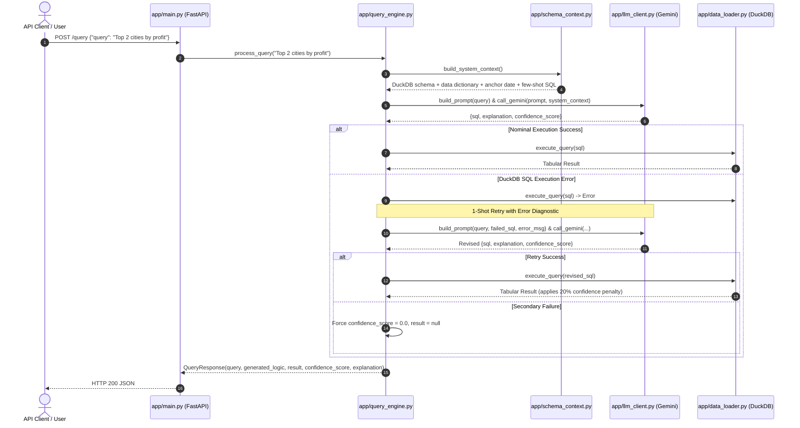

# Intelligent Analytics Query Engine

A clean, minimal, and direct natural language analytics query engine that converts business questions into executable SQL, runs them against in-memory DuckDB tables, and returns verified results with an explanation and calibrated confidence score.

---

## 1. Approach

Built for clarity, speed, and maintainability:
- **In-Memory DuckDB Engine**: Ingests `dataset/sales_data.csv` and `dataset/targets.csv` directly into memory at startup using native `read_csv_auto`. No external database, no ORM.
- **Direct Domain Grounding**: Physical table schemas are extracted dynamically via `PRAGMA table_info`, while business formulas from `dataset/data_dictionary.json` (such as `revenue = quantity * unit_price * (1 - discount)`), temporal anchors (`2024-03-31`), and targets join syntax are injected into the system prompt.
- **Single Gemini LLM Call**: Translates questions into structured JSON (`sql`, `explanation`, `confidence_score`) via a single direct call to Google GenAI (`gemini-3.6-flash`).
- **Resilient 1-Shot Retry**: If DuckDB raises a syntax or execution error, the engine retries once by sending the failed query and exact error message back to Gemini for correction.
- **Confidence Calibration**:
  - Clean execution: preserves model confidence score ($0.85$–$1.0$).
  - Corrected execution (after retry): penalized by 20% ($\times 0.80$).
  - Valid SQL returning 0 rows: capped at $0.30$.
  - Persistent failure: forced to $0.0$ (`result: null`).

---

## 2. Architecture & Request Flow



---

## 3. Codebase Structure

Minimal, functional codebase (under 200 lines of application code total):

```text
├── app/
│   ├── __init__.py          # Package initialization
│   ├── main.py              # FastAPI app, lifespan setup, and /health & /query endpoints
│   ├── frontend.py          # Minimal Streamlit UI: natural language query input & result display
│   ├── models.py            # Pydantic schemas: QueryRequest & QueryResponse
│   ├── data_loader.py       # DuckDB in-memory table loader (read_csv_auto) & query executor
│   ├── schema_context.py    # Schema introspection & system prompt assembler
│   ├── llm_client.py        # Gemini client: build_prompt & call_gemini
│   └── query_engine.py      # Core orchestrator: execution, 1-shot retry, confidence calibration
├── tests/
│   ├── test_engine.py       # Pytest suite verifying table loading, joins, window functions, and retries
│   └── test_frontend.py     # Pytest suite verifying Streamlit frontend interactions and error handling
├── dataset/                 # Operational data files
│   ├── sales_data.csv       # Order-level sales transactions
│   ├── targets.csv          # Regional monthly revenue targets
│   ├── data_dictionary.json # Semantic definitions, metric formulas, and time mappings
│   └── nl_queries.json      # Sample validation queries
├── run_validation.py        # Automated benchmark script running nl_queries.json
├── requirements.txt         # Minimal runtime dependencies
├── .env                     # Local environment configuration
└── README.md
```

---

## 4. Setup & Running

### 4.1 Installation
```bash
# Create and activate virtual environment
python3 -m venv .venv
source .venv/bin/activate

# Install dependencies
pip install -r requirements.txt
```

### 4.2 Configuration
Add your Google Gemini API key to `.env`:
```bash
echo "GEMINI_API_KEY=your_gemini_api_key_here" > .env
echo "API_URL=http://localhost:8000" >> .env
```

### 4.3 Running the Services

Run the backend and frontend concurrently in two separate terminal windows:

```bash
# Terminal 1: Backend API (FastAPI)
python3 -m uvicorn app.main:app --port 8000 --reload

# Terminal 2: Frontend Web UI (Streamlit)
streamlit run app/frontend.py
```

Health check:
```bash
curl http://localhost:8000/health
# Response: {"status":"ok","tables_loaded":["sales_data","targets"]}
```

---

## 5. API Usage

### Execute Natural Language Query
**Endpoint**: `POST /query`  
**Request Payload**:
```json
{
  "query": "Total sales in India for March"
}
```

**Response (HTTP 200)**:
```json
{
  "query": "Total sales in India for March",
  "generated_logic": "SELECT SUM(quantity * unit_price * (1 - discount)) AS revenue FROM sales_data WHERE country = 'India' AND strftime(CAST(order_date AS DATE), '%Y-%m') = '2024-03';",
  "result": [
    {
      "revenue": 108.0
    }
  ],
  "confidence_score": 0.95,
  "explanation": "Calculated total revenue for orders in India in March 2024 using quantity * unit_price * (1 - discount)."
}
```

---

## 6. Testing & Validation

### Run Pytest Suite
```bash
python3 -m pytest tests/test_engine.py -v
```
Runs unit tests for table loading, complex DuckDB SQL (multi-table target joins, window ranking functions, percentage contributions), query retry recovery, confidence calibration, and HTTP endpoints.

### Run Benchmark Validation
```bash
python3 run_validation.py
```
Executes all 8 canonical validation queries from `dataset/nl_queries.json` and outputs formatted results.
